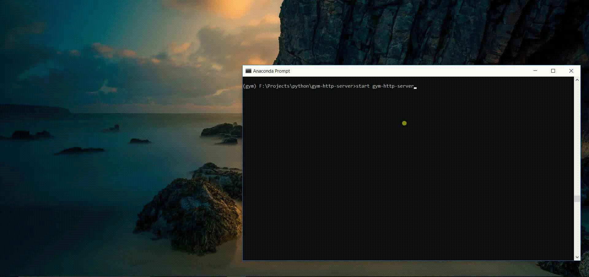

# Gym HTTP Server

[](https://travis-ci.org/saravanabalagi/gym-http-server)


This project provides a local REST API to the [gym](https://github.com/openai/gym) open-source library, allowing development in languages other than python.

The package includes an [example client](gym_http_server/example_client.py) and an [example agent](gym_http_server/example_agent.py), to demonstrate how to interact with the server.



## Installation

Install the package using pip:

```sh
pip install gym-http-server
```

## Usage

### Direct Usage

Use it simply from anywhere by calling
```sh
gym-http-server
```

If you would like to run on a specific port, use `--listen` and `--port`
```sh
gym-http-server -l 127.0.0.1 -p 5000
```

### Pythonic Usage

If you want to use this inside your python script,
```python
from gym_http_server import start_server
start_server()
```

If you want to specify ip and port,
```python
start_server(listen=='127.0.0.1', port==5000)
```

### Verify installation

The package includes an [example client](gym_http_server/example_client.py) and an [example agent](gym_http_server/example_agent.py).

To check connectivity with the server, start the server and run in separate terminal

```sh
start gym-http-server           # windows
gym-http-server &               # linux and mac
```

and then run example client to perform a single step in `CartPole-v0`

```sh
python -m gym_http_server.example_client
```

or the example agent to perform 100 episodes in the same environment

```sh
python -m gym_http_server.example_agent
```

And you can also check the logs stored at `tmp` folder.

## API specification


  * POST `/v1/envs/`
      * Create an instance of the specified environment
      * param: `env_id` -- gym environment ID string, such as 'CartPole-v0'
      * returns: `instance_id` -- a short identifier (such as '3c657dbc')
	    for the created environment instance. The instance_id is
        used in future API calls to identify the environment to be
        manipulated

  * GET `/v1/envs/`
      * List all environments running on the server
	  * returns: `envs` -- dict mapping `instance_id` to `env_id`
	    (e.g. `{'3c657dbc': 'CartPole-v0'}`) for every env on the server

  * POST `/v1/envs/<instance_id>/reset/`
      * Reset the state of the environment and return an initial
        observation.
      * param: `instance_id` -- a short identifier (such as '3c657dbc')
        for the environment instance
      * returns: `observation` -- the initial observation of the space

  * POST `/v1/envs/<instance_id>/step/`
      *  Step though an environment using an action.
      * param: `instance_id` -- a short identifier (such as '3c657dbc')
        for the environment instance
	  * param: `action` -- an action to take in the environment
      * returns: `observation` -- agent's observation of the current
        environment
      * returns: `reward` -- amount of reward returned after previous action
      * returns: `done` -- whether the episode has ended
      * returns: `info` -- a dict containing auxiliary diagnostic information

  * GET `/v1/envs/<instance_id>/action_space/`
      * Get information (name and dimensions/bounds) of the env's
        `action_space`
      * param: `instance_id` -- a short identifier (such as '3c657dbc')
        for the environment instance
      * returns: `info` -- a dict containing 'name' (such as 'Discrete'), and
    additional dimensional info (such as 'n') which varies from
    space to space

  * GET `/v1/envs/<instance_id>/observation_space/`
      * Get information (name and dimensions/bounds) of the env's
        `observation_space`
      * param: `instance_id` -- a short identifier (such as '3c657dbc')
        for the environment instance
      * returns: `info` -- a dict containing 'name' (such as 'Discrete'), and
    additional dimensional info (such as 'n') which varies from
    space to space

  * POST `/v1/envs/<instance_id>/monitor/start/`
      * Start monitoring
      * param: `instance_id` -- a short identifier (such as '3c657dbc')
        for the environment instance
      * param: `force` (default=False) -- Clear out existing training
        data from this directory (by deleting every file
        prefixed with "openaigym.")
      * param: `resume` (default=False) -- Retain the training data
        already in this directory, which will be merged with
        our new data
      * (NOTE: the `video_callable` parameter from the native
    `env.monitor.start` function is NOT implemented)

  * POST `/v1/envs/<instance_id>/monitor/close/`
      * Flush all monitor data to disk
      * param: `instance_id` -- a short identifier (such as '3c657dbc')
        for the environment instance

  * POST `/v1/upload/`
      * Flush all monitor data to disk
      * param: `training_dir` -- A directory containing the results of a
        training run.
      * param: `api_key` -- Your OpenAI API key
      * param: `algorithm_id` (default=None) -- An arbitrary string
        indicating the paricular version of the algorithm
        (including choices of parameters) you are running.

  * POST `/v1/shutdown/`
      * Request a server shutdown
      * Currently used by the integration tests to repeatedly create and destroy fresh copies of the server running in a separate thread


Forked from the archived [gym-http-api](https://github.com/openai/gym-http-api)


## Licence

The MIT License

Copyright (c) 2019 Saravanabalagi Ramachandran

Permission is hereby granted, free of charge, to any person obtaining a copy
of this software and associated documentation files (the "Software"), to deal
in the Software without restriction, including without limitation the rights
to use, copy, modify, merge, publish, distribute, sublicense, and/or sell
copies of the Software, and to permit persons to whom the Software is
furnished to do so, subject to the following conditions:

The above copyright notice and this permission notice shall be included in
all copies or substantial portions of the Software.

THE SOFTWARE IS PROVIDED "AS IS", WITHOUT WARRANTY OF ANY KIND, EXPRESS OR
IMPLIED, INCLUDING BUT NOT LIMITED TO THE WARRANTIES OF MERCHANTABILITY,
FITNESS FOR A PARTICULAR PURPOSE AND NONINFRINGEMENT. IN NO EVENT SHALL THE
AUTHORS OR COPYRIGHT HOLDERS BE LIABLE FOR ANY CLAIM, DAMAGES OR OTHER
LIABILITY, WHETHER IN AN ACTION OF CONTRACT, TORT OR OTHERWISE, ARISING FROM,
OUT OF OR IN CONNECTION WITH THE SOFTWARE OR THE USE OR OTHER DEALINGS IN
THE SOFTWARE.

